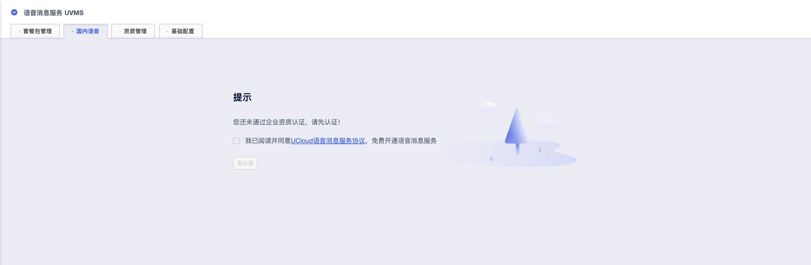

<!--一下子提供一种思路，欢迎大家发挥 -->

# SDK文档

语音消息服务（UVMS）SDK文档概览。

|SDK|示例|GitHub地址|版本|
|---|------|--------|-----|
|Python SDK|[UVMS Python Example](#_1）uvms-python-example)|[Python SDK](https://github.com/ucloud/ucloud-sdk-python3)|Python 3.5+|
|Go SDK|[UVMS Go Example](#_2）uvms-go-example)|[Go SDK](https://github.com/ucloud/ucloud-sdk-go)|Go 1.10+|


## 一、准备工作

### 1）获取SDK密钥信息
* 获取 SDK 密钥信息，也即公钥（也即 PublicKey）、私钥（也即 PrivateKey），可从[API产品/API密钥](https://console.ucloud.cn/uaccount/api_manage)获取，获取步骤可参照短信服务产品文档：[如何获取公钥、私钥](https://docs.ucloud.cn/usms/faq/1109)。


### 2）获取项目ID
* 指当前账号的当前在用项目的项目ID，可从[资源统计](https://console.ucloud.cn/dashboard)获取当前的项目ID，获取步骤参考：[如何获取项目ID](https://docs.ucloud.cn/usms/faq/1109)。


### 3）完成企业实名制认证

* 企业实名认证：[点击账号实名认证](https://passport.ucloud.cn/login?service=https%3A%2F%2Fconsole.ucloud.cn%2Fuaccount%2Fauthentication#login)，可联系您的客户经理查看进度。


### 4）开通语音消息服务



* 勾选我已阅读并同意[UCloud语音消息服务协议](/uvms/introduction/agreement.md)，免费开通语音消息服务；勾选同意后，才可以进行企业资质认证。


### 5）创建企业完成资质审核

根据基础运营商的管控要求，使用语音线路和申请号码需提交相关企业资质材料，企业资质审核通过后您才可以正式使用语音消息服务。

* [点击创建企业](https://console.ucloud.cn/uvms/company/create)，按要求准备相关材料并上传。


### 6）添加应用（按需）

除内部生产告警场景外，其他使用场景均需添加应用，应用指的是您需要使用语音消息服务的产品，如APP/网站/小程序/公众号等，应用审核通过后才可以创建语音模板。

* [点击创建应用](https://console.ucloud.cn/uvms/qualification)，按要求上传相关材料。


### 7）创建模板

语音模板支持两种类型：文本模板及音频模板，文本模板可通过TTS转换成音频进行播报，音频模板为您提前录制好的固定音频内容。在发起语音呼叫请求时，调用对应的模板ID及变量来实现语音呼叫，因此您需要在发起请求前，创建好语音模板并通过审核，才可以正常使用。

* [点击创建模板](https://console.ucloud.cn/uvms/interval)


### 8）购买语音套餐包

已完成企业实名认证及企业资质认证的账号可购买语音套餐包，特别注意的是专享号码套餐包需申请专享号码配套使用，随机号码套餐包与专享号码套餐包不通用。

* [立即购买语音套餐包](https://console.ucloud.cn/uvms/buy?Purpose=1)


### 9）申请号码（按需）

如您对号码外显、号码归属地等有特殊要求，如需要靓号、95号、指定号码作为主叫号码等，您需要申请专享号码。

* [点击申请号码](https://console.ucloud.cn/uvms/interval)


## 二、配置SDK

### 1）安装SDK

* 参考 UCloud SDK [快速开始](https://docs.ucloud.cn/opensdk-python/quickstart)，安装 Python SDK；
* 参考 UCloud SDK [快速开始](https://docs.ucloud.cn/opensdk-go/quickstart)，安装 Go SDK。


### 2）参数说明

* 被叫号码（CalledNumber）: 采用 E.164 标准，格式为+[国家代码][用户号码]。 例如：+86135xxxx5678， 其中前面有一个+号 ，86为国家码，135xxxx5678为手机号；

* 模板ID（TemplateId) : 首次使用，需要在Ucloud控制台申请模板，将审核通过的后的模板 ID传入此处；

* 模板参数列表(TemplateParams):模板中可以传入参数变量，申请时模板当中有几个参数，此处就传入几个；

* 主叫号码（FromNumber）: 在使用随机号码时，不需要填这个参数。如果希望使用自己所申请的专属号码进行下发，请传入。专属号码可以在Ucloud控制台进行申请；

* 自定义ID（UserID）: 自定义的业务标识ID，字符串（ 长度不能超过32 位），不支持 单引号、表情包符号等特殊字符。可用于后续发送情况查询。


### 3）相关限制

* 模板名称和内容不支持添加特殊符号，如%&@等，模板内容不允许超过1000个字（含变量），使用TTS合成时，仅支持常见汉字、字母、数字及标点；
* 如果发送验证码类型消息，模板参数只能使用字母、数字，且长度不超过6位；
* 语音通知的模板不支持组合变量、变量相邻和全变量。


## 三、示例

### 1）UVMS Python Example

#### Quickstart

```shell
export UCLOUD_PROJECT_ID=org-xxx
export UCLOUD_PUBLIC_KEY=deIv************Lk7R_J9
export UCLOUD_PRIVATE_KEY=t0ejC***********BxGclIU
export UCLOUD_UVMS_TEMPLATE_ID=UVV*****Y
export UCLOUD_UVMS_TEMPLATE_PARAM=2344
export UCLOUD_UVMS_PHONE_NUMBER=188********
```

Run:

```
python3 ./main.go
```


### 2）UVMS Go Example

#### Quickstart

```shell
export UCLOUD_PROJECT_ID=org-xxx
export UCLOUD_PUBLIC_KEY=deIv************Lk7R_J9
export UCLOUD_PRIVATE_KEY=t0ejC***********BxGclIU
export UCLOUD_UVMS_TEMPLATE_ID=UVV*****Y
export UCLOUD_UVMS_TEMPLATE_PARAM=2344
export UCLOUD_UVMS_PHONE_NUMBER=188********
```

Run:

```
go run ./main.go
```
