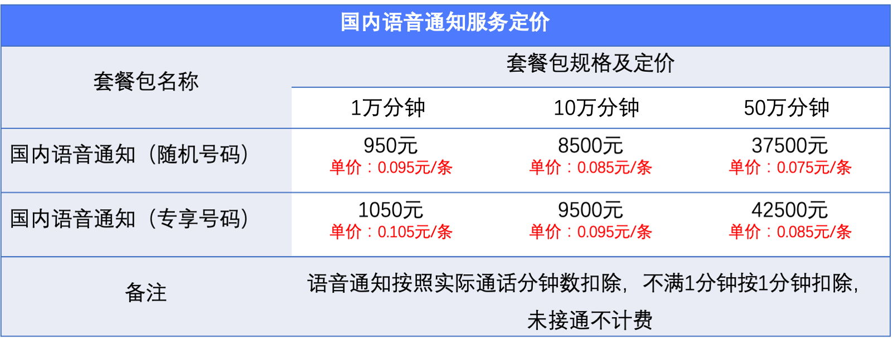
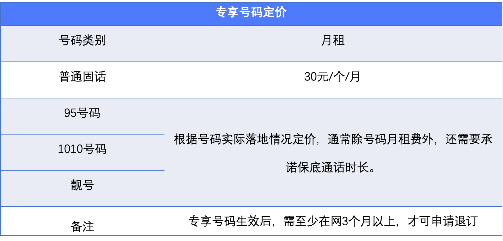

<!--一下子提供一种思路，欢迎大家发挥 -->

# 产品定价

## 国内语音定价

四种套餐包类型：国内语音验证码（随机号码）、国内语音验证码（专享号码）、国内语音通知（随机号码）、国内语音通知（专享号码），供您从容选择。

* 国内语音验证码定价：

* 国内语音通知定价

>注意：当前语音消息服务仅支持预付费模式，随机号码套餐包和专享号码套餐包不可通用，购买专享号码套餐包需购买专享号码。

## 2.专享号码定价

四种号码类别：普通固话、95号码、1010号码、靓号，供您从容选择。

* 专享号码定价

>注意：当前语音消息服务仅支持预付费模式，号码月租按月扣费，号码生效当月即开始扣费，不满一个月按照一个月扣费，如某号码生效时间是2022年3月20日，当月会扣除该号码3月整月月租费。
>号码申请退订审核通过后，号码当月仍可正常使用，按照整月月租扣费，次月退订生效不再扣费，如某号码于2022年3月20日申请退订，UCloud于2022年3月22日审核通过，该号码3月份仍可正常使用，3月正常扣除整月月租费，2022年4月1日该号码退订生效，不再扣费。
